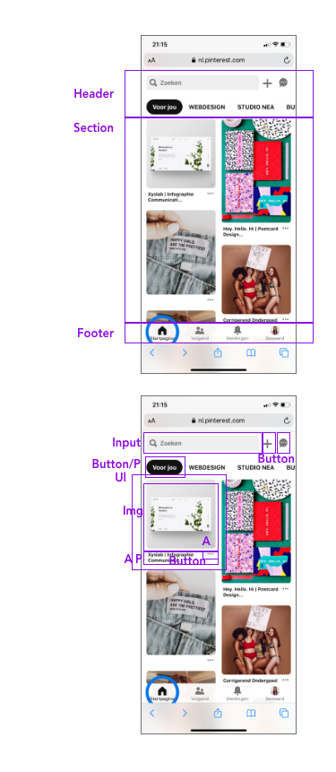

# Procesverslag
**Auteur:** Neanke Veenstra

Markdown cheat cheet: [Hulp bij het schrijven van Markdown](https://github.com/adam-p/markdown-here/wiki/Markdown-Cheatsheet). Nb. de standaardstructuur en de spartaanse opmaak zijn helemaal prima. Het gaat om de inhoud van je procesverslag. Besteedt de tijd voor pracht en praal aan je website.

## Bronnenlijst
1. slider: https://www.youtube.com/watch?v=pGHOaY4dhAA
2. google maps: https://www.youtube.com/watch?v=KIC0OK9nKXY
3. formulier: https://www.w3schools.com/html/html_forms.asp
4. menubalk: Dennis Wegereef
5. back-to-topbutton: Simone van Zeijl van simonevanzeijl.com
6. back-to-topbutton: https://developer.mozilla.org/en-US/docs/Web/API/Element/getBoundingClientRect
7. fonts: https://css-tricks.com/snippets/css/using-font-face/
8. hr: https://www.w3schools.com/tags/tag_hr.asp
9. flex: https://css-tricks.com/snippets/css/a-guide-to-flexbox/

## Eindgesprek (week 7/8)

Goed: Het toevoegen van de content ging super snel en makkelijk, de styling in css ging ook beter dan verwacht. Daarnaast lukte het mij ook beter om bepaalde elementen op google te zoeken en de uitleg te begrijpen. Zoals het toevoegen van een slider en een google maps.
Lastig: Ik had af en toe nog wel problemen met het schalen van elementen wanneer het responsive werd. Javascript blijft natuurlijk ook lastig maar hierbij heb ik hulp gezocht waardoor het wel sneller lukte. Uiteindelijk was ik meer tijd kwijt aan de styling.

**Screenshot(s):**

(images/eind1.png) (images/eind2.png) (images/eind3.png)(images/eind4.png) (images/eind5.png) (images/eind6.png)

## Voortgang 3 (week 6)

### Stand van zaken

Goed: ik heb een carousal toegevoegd en de website meer responsive gemaakt door de kolommen naast elkaar te zetten op desktop version. Daarnaast is het mij ook gelukt om een hamburger-menu te laten veranderen in een menu-balk als de website groter wordt.
Slecht: het importeren van een font lukt mij nog niet, net zoals andere kleine styling elementen zoals foto's positioneren. JS is wel gelukt maar er staan nog veel foutmeldingen in :(

**Screenshot(s):**

(images/voor3.png) (images/voor3-1.png) (images/voor3-2.png)

### Agenda voor meeting

css, js

### Verslag van meeting
Al op de goede weg, nog aandachtspuntjes voor toegankelijheid, margins en het schalen van afbeeldingen. 

## Voortgang 2 (week 5)

### Stand van zaken

Goed: content in html zetten en styling in css
Slecht: lay-out in css, flexbox, responsive zoals met hamburger menu
Deze weken niet veel tijd er aan kunnen besteden wegens drukte en ziekte, er moet veel ingehaald worden

**Screenshot(s):**

(images/voortgang2-1.png)(images/voortgang2-2.png)(images/voortgang2-3.png) (images/voortgang2-4.png)

### Agenda voor meeting

css, flexbox, responsive maken

### Verslag van meeting
Kijken naar elementen die ik in de website kan gebruiken, zoals een carousal of een menu-balk die naar beneden gaat. Er moet nog wel veel gebeuren omdat ik een week stil heb gezeten. 

## Voortgang 1 (week 3)

### Stand van zaken

Goed: content in html zetten en styling in css
Slecht: lay-out in css, repsonsive maken

**Screenshot(s):**

(images/img0443.png)(images/img0444.png)(images/img0445.png)

### Agenda voor meeting

lay-out, css, flexbox, responsive maken

### Verslag van meeting

Website is responsive gemaakt. Nog uitvogelen met positioneren en flexbox. Hamburgermenu krijgen we nog bijles in. Beter ordenen, dus articles in een section plaatsen.

## Intake (week 1)

**Je startniveau:** blauw

**Je focus:** responsive

**Je opdracht:** https://www.barbotanique.nl/

**Screenshot(s):** 
(images/img0438.png)(images/img0439.png)(images/img0440.png)(images/img0441.png)

**Breakdown-schets(en):**

