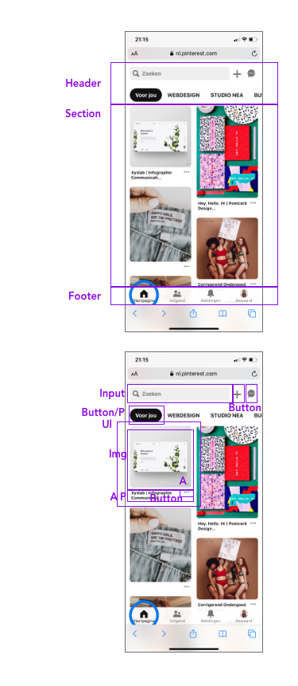

# Procesverslag
**Auteur:** -Neanke Veenstra-

Markdown cheat cheet: [Hulp bij het schrijven van Markdown](https://github.com/adam-p/markdown-here/wiki/Markdown-Cheatsheet). Nb. de standaardstructuur en de spartaanse opmaak zijn helemaal prima. Het gaat om de inhoud van je procesverslag. Besteedt de tijd voor pracht en praal aan je website.

## Bronnenlijst
1. -bron 1-
2. -bron 2-
3. -...-

## Eindgesprek (week 7/8)

-dit ging goed & dit was lastig-

**Screenshot(s):**

-screenshot(s) van je eindresultaat-

## Voortgang 3 (week 6)

-same as voortgang 1-

## Voortgang 2 (week 5)

-same as voortgang 1-

## Voortgang 1 (week 3)

### Stand van zaken

Goed: content in html zetten en styling in css
Slecht: lay-out in css, repsonsive maken

**Screenshot(s):**

(images/img0443.png) (images/img0444.png) (images/img0445.png)

### Agenda voor meeting

lay-out, css, flexbox, responsive maken

### Verslag van meeting

-na afloop snel uitkomsten vastleggen-

## Intake (week 1)

**Je startniveau:** blauw

**Je focus:** responsive

**Je opdracht:** https://www.barbotanique.nl/

**Screenshot(s):** (images/img0438.png) (images/img0439.png) (images/img0440.png) (images/img0441.png)

**Breakdown-schets(en):**

